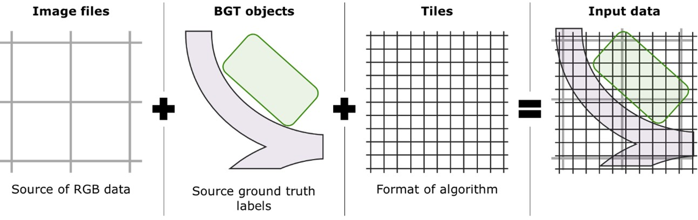
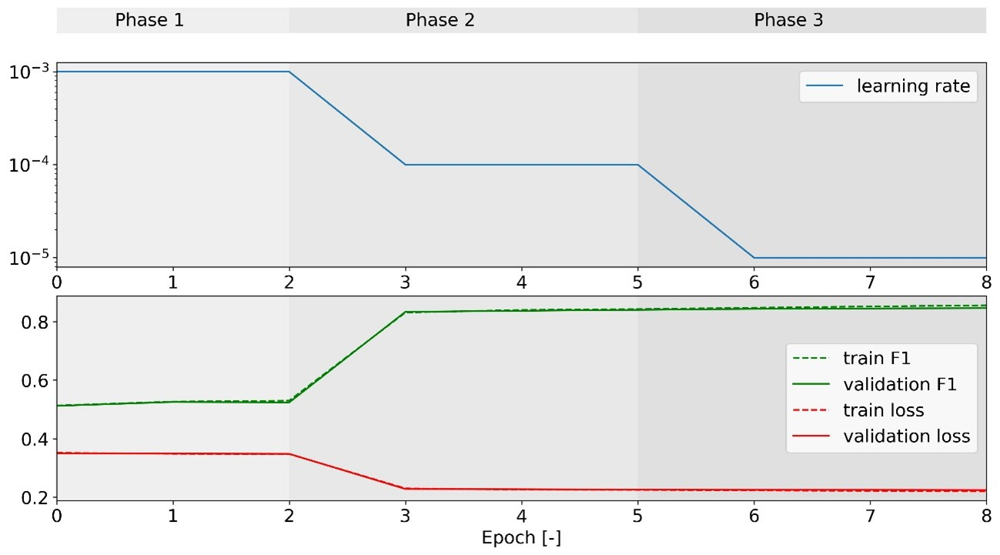
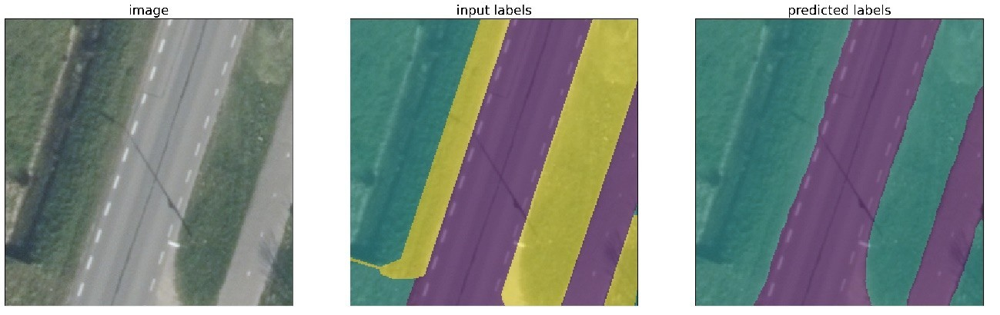
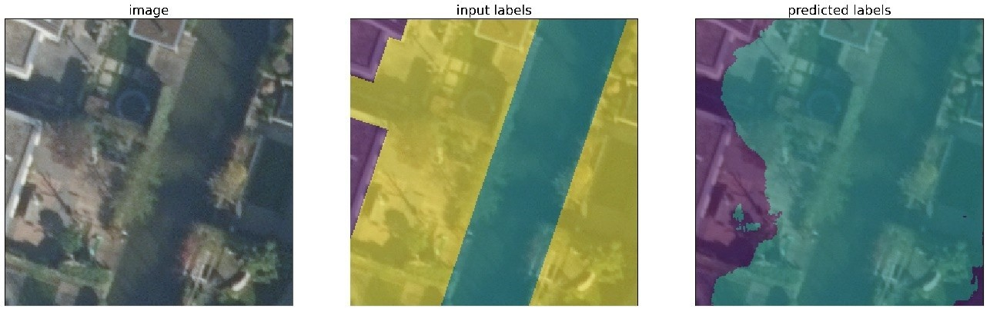

## Introduction: The Urban Imperviousness Puzzle

Cities are getting hotter and wetter. Urban planners and climate scientists know that impervious surfaces—roads, rooftops, parking lots—are a big part of the problem. But there’s no complete dataset that tells us which surfaces in a city are truly impervious. So, can we use satellite and aerial imagery to fill this gap using machine learning? That’s the question we set out to answer.

---

## Technical Journey: From Data to Model

### Data
- **Ground truth:** We used the Dutch BGT dataset (Basisregistratie Grootschalige Topografie) to extract hard labels for impervious and non-impervious surfaces.
- **Imagery:** Two sources: satellite images at 50cm resolution and aerial photos at 7.5cm.
- **Preparation:** Images were tiled, clouds were excluded, and everything was stored in HDF5 format for fast access during training.

<figure>
    
    <figcaption>Data preparation process</figcaption>
</figure>

### Methodology
- **Extraction:** We mapped BGT geometries to “completely impervious” and “completely non-impervious” classes.
- **Segmentation:** The problem was framed as semi-supervised, multi-class image segmentation.

### Modeling
- **Architecture:** U-net, a neural network designed for image segmentation, initialized with pre-trained ImageNet weights.
- **Training:** Three phases—first the classification head, then the decoder, then the full model. Weighted cross-entropy loss (with class weights set by data distribution), Adam optimizer, and a learning rate scheduler.
- **Data split:** 80% training, 10% validation, 10% test—randomly split at the tile level.

<figure>
    
    <figcaption>Three-phases training process for aerial imagery</figcaption>
</figure>

---

## Results & Surprises

### Macro Evaluation
- The model achieved high recall: 90% for satellite imagery, 96% for aerial imagery. These results are on par with recent literature.
- However, recall varied by region and class distribution—spatial consistency remains a challenge.

<table>
  <thead>
    <tr>
      <th colspan="5">Training set</th>
    </tr>
    <tr>
      <th></th><th></th>
      <th colspan="3">prediction</th>
    </tr>
    <tr>
      <th></th><th></th>
      <th>volledig verhard</th>
      <th>volledig onverhard</th>
      <th>onbekend</th>
    </tr>
  </thead>
  <tbody>
    <tr>
      <td rowspan="3"><strong>ground truth</strong></td>
      <td>volledig verhard</td>
      <td>96.2%</td><td>3.8%</td><td>0.0%</td>
    </tr>
    <tr>
      <td>volledig onverhard</td>
      <td>3.9%</td><td>96.1%</td><td>0.0%</td>
    </tr>
    <tr>
      <td>onbekend</td>
      <td>62.4%</td><td>37.6%</td><td>0.0%</td>
    </tr>
  </tbody>
</table>

<table>
  <thead>
    <tr>
      <th colspan="5">Validation set</th>
    </tr>
    <tr>
      <th></th><th></th>
      <th colspan="3">prediction</th>
    </tr>
    <tr>
      <th></th><th></th>
      <th>volledig verhard</th>
      <th>volledig onverhard</th>
      <th>onbekend</th>
    </tr>
  </thead>
  <tbody>
    <tr>
      <td rowspan="3"><strong>ground truth</strong></td>
      <td>volledig verhard</td>
      <td>95.9%</td><td>4.1%</td><td>0.0%</td>
    </tr>
    <tr>
      <td>volledig onverhard</td>
      <td>4.1%</td><td>95.9%</td><td>0.0%</td>
    </tr>
    <tr>
      <td>onbekend</td>
      <td>62.7%</td><td>37.3%</td><td>0.0%</td>
    </tr>
  </tbody>
</table>

<table>
  <thead>
    <tr>
      <th colspan="5">Test set</th>
    </tr>
    <tr>
      <th></th><th></th>
      <th colspan="3">prediction</th>
    </tr>
    <tr>
      <th></th><th></th>
      <th>volledig verhard</th>
      <th>volledig onverhard</th>
      <th>onbekend</th>
    </tr>
  </thead>
  <tbody>
    <tr>
      <td rowspan="3"><strong>ground truth</strong></td>
      <td>volledig verhard</td>
      <td></td><td></td><td></td>
    </tr>
    <tr>
      <td>volledig onverhard</td>
      <td></td><td></td><td></td>
    </tr>
    <tr>
      <td>onbekend</td>
      <td></td><td></td><td></td>
    </tr>
  </tbody>
</table>

<table>
  <thead>
    <tr>
      <th colspan="5">City center</th>
    </tr>
    <tr>
      <th></th><th></th>
      <th colspan="3">prediction</th>
    </tr>
    <tr>
      <th></th><th></th>
      <th>volledig verhard</th>
      <th>volledig onverhard</th>
      <th>onbekend</th>
    </tr>
  </thead>
  <tbody>
    <tr>
      <td rowspan="3"><strong>ground truth</strong></td>
      <td>volledig verhard</td>
      <td>95.9%</td><td>4.1%</td><td>0.0%</td>
    </tr>
    <tr>
      <td>volledig onverhard</td>
      <td>4.1%</td><td>95.9%</td><td>0.0%</td>
    </tr>
    <tr>
      <td>onbekend</td>
      <td>62.7%</td><td>37.3%</td><td>0.0%</td>
    </tr>
  </tbody>
</table>

<table>
  <thead>
    <tr>
      <th colspan="5">Suburban area</th>
    </tr>
    <tr>
      <th></th><th></th>
      <th colspan="3">prediction</th>
    </tr>
    <tr>
      <th></th><th></th>
      <th>volledig verhard</th>
      <th>volledig onverhard</th>
      <th>onbekend</th>
    </tr>
  </thead>
  <tbody>
    <tr>
      <td rowspan="3"><strong>ground truth</strong></td>
      <td>volledig verhard</td>
      <td></td><td></td><td></td>
    </tr>
    <tr>
      <td>volledig onverhard</td>
      <td></td><td></td><td></td>
    </tr>
    <tr>
      <td>onbekend</td>
      <td></td><td></td><td></td>
    </tr>
  </tbody>
</table>

### Micro Evaluation
- Visual inspection showed strong generalization for roads, but weak performance in backyards. The model also successfully identified non-vegetated, non-impervious surfaces—something vegetation indices can’t do.

<figure>
    
    <figcaption>Good generalization for roads and surroundings (Green: pervious, purple: impervious, yellow: unknown)</figcaption>
</figure>

<figure>
    
    <figcaption>Poor generalization for backyards (Green: pervious, purple: impervious, yellow: unknown)</figcaption>
</figure>
---

## Lessons Learned & What’s Next

- Domain expertise is valuable for refining ground truth, but the technical pipeline is robust and reproducible.
- Binary segmentation is a solid starting point. Future work could explore soft labels, region-based loss functions, or attention mechanisms to improve spatial consistency and generalization.
- Generalization remains a challenge—further research is needed on stratification and simulation approaches.

---

## Conclusion

This pilot shows that with open data and modern computer vision, we can make real progress in mapping urban imperviousness. The approach isn’t perfect—domain expertise and more sophisticated models could push it further—but it’s a strong foundation for future work.
