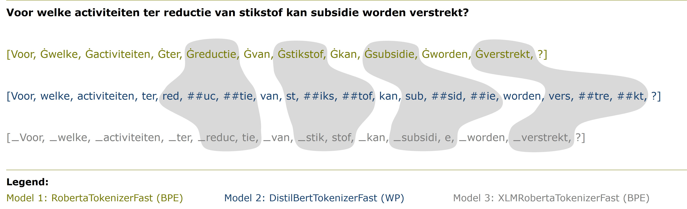

## The problem with policy documents

Policy documents are a goldmine of information but it's hard to find the right ones quickly. Keyword search can miss relevant documents that use different terminology, while reading through hundreds of results is time-consuming. Semantic search offers a promising solution but how well does it actually work for the formal and complex language in Dutch policy documents?

---

## The dataset: 200,000 policy documents

The *Officiële Bekendmakingen* portal publishes official government decisions, regulations, and subsidy schemes from municipalities, provinces, water authorities, and national government. For this pilot, we scoped to two publication types from 2015 to 2023:

- **Waterschapsblad** (regional water authority publications): ~117,000 documents
- **Provinciaal blad** (provincial publications): ~90,000 documents

That's a lot of documents. Each one is structured XML with headers, introductions, policy text, and standardized closings. Documents vary considerably in length—on average around 400 words for Waterschapsblad and 550 for Provinciaal blad—which turned out to matter a lot for how we split them up.

---

## The embedding models: three flavors of Dutch text representation

We tested three such models:

| | Model 1 | Model 2 | Model 3 |
|---|---|---|---|
| **Name** | robbert-2022-dutch-sentence-transformers | distiluse-base-multilingual-cased-v1 | BGE-M3 |
| **Language focus** | 100% Dutch | 15 languages incl. Dutch | 100+ languages incl. Dutch |
| **Parameters** | 119M | 135M | 567M |
| **Max sequence length** | 128 tokens | 128 tokens | 8192 tokens |

Model 1 was purpose-built for Dutch. Model 3 is a heavyweight multilingual model with a much longer context window. Model 2 sits somewhere in between.

---

## The experiment: one query, twelve configurations

We kept the experiment focused: one query, twelve configurations, evaluated on the top 5 results.

The query was: *"Voor welke activiteiten ter reductie van stikstof kan subsidie worden verstrekt?"* (Which activities to reduce nitrogen emissions can receive subsidies?)

The twelve configurations came from crossing three variables:
- **Text representation model**: Model 1, 2, or 3
- **Search mode**: AI-only (semantic) or hybrid (semantic + keyword)
- **Result filter**: with or without restricting to the category *Landbouw Organisatie en beleid*

A domain expert labeled all 60 resulting documents (5 results × 12 configurations) as relevant, partly relevant, or not relevant.

---

## The results: surprises all around

### Bigger isn't always better

Model 3 is nearly five times larger than Model 1, yet they perform similarly on this task. Model 2, despite having access to more multilingual training data, actually underperforms both. This is a useful reminder: model size and breadth don't guarantee better performance on a narrow, domain-specific task. A model trained specifically on Dutch text can outpunch its weight class.

  <canvas id="relevanceChart"></canvas>

### Hybrid search underperforms—and we're not sure why

This is the most counterintuitive finding. The literature consistently shows that hybrid search (combining semantic and keyword signals) outperforms semantic-only search. We found the opposite: hybrid configurations performed worse, and in some cases dramatically so. Models 1 and 3 in hybrid mode returned no relevant documents at all in the top 5 when no category filter was applied.

The frustrating part: we can't fully explain it. The hybrid search implementation runs on Databricks' [Mosaic AI Vector Search](https://docs.databricks.com/aws/en/vector-search/vector-search#how-does-mosaic-ai-vector-search-work), whose code isn't open source. We can't inspect how the [Okapi BM25](https://en.wikipedia.org/wiki/Okapi_BM25) algorithm is configured. This is a limitation worth flagging for anyone else running similar experiments on managed search platforms.

### The category filter makes a big difference

Restricting results to the *Landbouw Organisatie en beleid* category improved relevance by 20 to 40 percentage points across configurations. That's a massive lift for a simple filter. It also reveals an important truth: a smarter metadata strategy can partly substitute for a smarter model. Before you fine-tune anything, figure out whether you have useful structure you're not using.

### Tokenization: a hidden culprit?

One hypothesis for the performance differences between models is tokenization. Model 1 uses Byte-Pair Encoding (BPE), Model 2 uses WordPiece (WP), and Model 3 also uses BPE but with a different vocabulary.

<figure>
    
    <figcaption>Tokenization of the search query across different models</figcaption>
</figure>

The tokenization of the search query varies significantly across models. Model 3 splits key words like `stikstof` and `subsidie` into multiple small tokens, which could impact their ability to capture the query's meaning effectively.

Moreover, for the same Dutch sentence, the number of tokens varies considerably across models. Because Models 1 and 2 have a maximum sequence length of 128 tokens—and 14% to 27% of our document chunks exceed that limit—some content is simply cut off. Model 3's 8192-token limit means it almost never truncates. Whether truncation explains the performance gap is still an open question.

---

## What's next

The pilot proved the concept works: AI search can surface relevant documents that keyword search misses. But there's meaningful work between "useful pilot" and "production tool":

- **Fine-tuning on in-domain data**: The *Officiële Bekendmakingen* dataset contains Q&A pairs from the *Tweede Kamer* (Dutch parliament) that could be used to fine-tune a text representation model on exactly the kind of language in policy documents. No one has published such a model on Hugging Face yet—an opportunity to contribute to Dutch NLP.
- **Manual hybrid implementation**: Instead of relying on a black-box managed service, building our own hybrid ranking would let us tune the blend between semantic and keyword signals properly.
- **Evaluation at scale**: One query is a proof of concept, not a benchmark. A real evaluation requires a test set covering the diversity of researcher questions.

---

## Takeaway

If you're building a search system over a specialized document corpus and keyword search isn't cutting it—this kind of pilot is a reasonable first step. Start with AI-only search before you add the complexity of hybrid. Don't assume a bigger model will win. And check your metadata: a well-chosen filter can do more than a model upgrade.